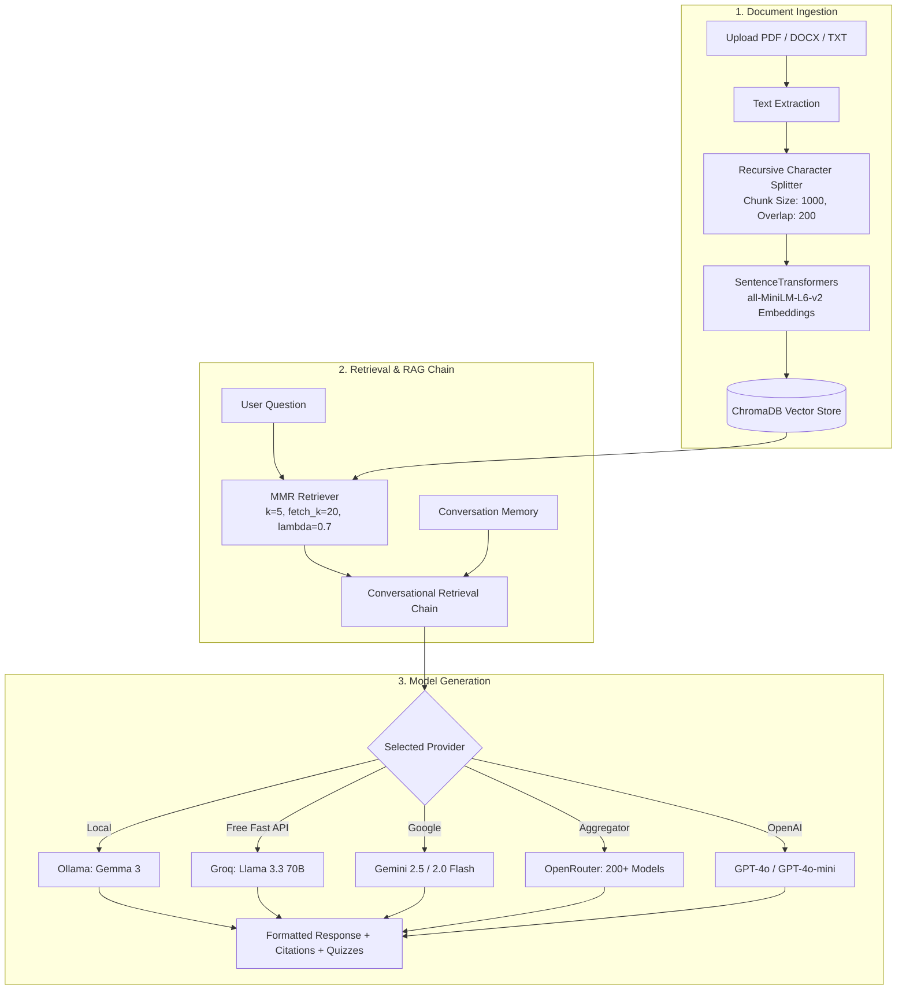

# 🧠 StudyMind AI — Intelligent Academic Companion & RAG Study Agent

<p align="center">
  
  
  
  
  
  
</p>

---

## 🌟 Overview

**StudyMind AI** is a next-generation study companion and Retrieval-Augmented Generation (RAG) assistant designed for students, researchers, and lifelong learners.

Upload your course notes, textbooks, lecture slides, or research papers in PDF, DOCX, or Markdown formats, and interact with your material through intelligent semantic search, verified citations, automatic practice quiz generation, smart summaries, and multi-modal cognitive responses.

StudyMind AI works seamlessly with **local offline models (Ollama Gemma 3)** or **cloud providers (Groq, Google Gemini, OpenRouter, and OpenAI)**.

---

## ✨ Key Features

| Feature | Description |
|---|---|
| 🏠 **100% Offline with Ollama** | Run locally with Google Gemma 3, Llama, or any Ollama model with zero data leaving your machine. |
| 🔥 **Ultra-Fast Cloud Inference** | Native support for **Groq** (Llama 3.3 70B) for lightning-fast answers on a generous free tier. |
| 🌐 **200+ Cloud Models** | Support for **OpenRouter** (DeepSeek R1, Claude 3.5, Gemini 2.0 Flash) and **OpenAI** (GPT-4o, GPT-4o-mini). |
| ✨ **Google Gemini Integration** | Seamless connectivity to Gemini 2.5 Flash, 2.0 Flash, and Pro models via Google AI Studio. |
| 📚 **Multi-Format Document Ingestion** | Ingest PDFs, Word documents (`.docx`), Markdown (`.md`), and raw text files (`.txt`). |
| 🔍 **Maximal Marginal Relevance (MMR)** | High-precision vector retrieval powered by `sentence-transformers` (`all-MiniLM-L6-v2`) and ChromaDB to avoid redundant context. |
| 🎯 **Verified Page Citations** | Every answer explicitly references the document name and exact page numbers used. |
| 🧠 **4 Cognitive Learning Modes** | Adapt answers to your learning style: **Standard Chat**, **Detailed Breakdown**, **Concise Keypoints**, and **ELI5 Analogies**. |
| 🧪 **Interactive Quiz Lab** | Automatically generate custom multiple-choice quizzes from your uploaded documents with instant grading and explanations. |
| 📊 **Session Analytics** | Monitor chunk count, documents indexed, queries asked, and real-time engine status. |
| 🛡️ **Session Isolation** | Automatic vector database cleanup on restart ensures zero cross-session document contamination. |

---

## 🏗️ Architecture & Pipeline



---

## 🚀 Quick Start Guide

### 1. Clone the Repository

```bash
git clone https://github.com/prxtxtk/StudyMind-AI.git
cd StudyMind-AI
```

### 2. Create and Activate Virtual Environment (Recommended)

**On Windows:**
```powershell
python -m venv venv
.\venv\Scripts\Activate.ps1
```

**On macOS / Linux:**
```bash
python3 -m venv venv
source venv/bin/activate
```

### 3. Install Dependencies

```bash
pip install -r requirements.txt
```

### 4. Run the Application

```bash
streamlit run app.py --server.port=8501 --browser.gatherUsageStats=false --server.fileWatcherType=none
```

Open your browser at **http://localhost:8501**.

---

## 🤖 Supported AI Providers & Setup

### 🏠 Option 1: Local Ollama (Free & Private)
1. Download and install [Ollama](https://ollama.com).
2. Pull your model of choice:
   ```bash
   ollama pull gemma3
   ```
3. Ensure Ollama is running (`ollama serve`).
4. In the app sidebar, select **🏠 Local (Ollama)** and click **Connect Ollama**.

---

### 🔥 Option 2: Groq (Recommended for Speed & Free Tier)
1. Get a free API key at [console.groq.com](https://console.groq.com).
2. Select **🔥 Groq (Free)** in the sidebar.
3. Paste your `gsk_...` API key, select a model like `llama-3.3-70b-versatile`, and click **Connect to Groq**.

---

### ✨ Option 3: Google Gemini
1. Get your free API key at [Google AI Studio](https://aistudio.google.com/app/apikey).
2. Select **✨ Google Gemini** in the sidebar.
3. Paste your `AIza...` key, choose `gemini-2.5-flash` or `gemini-2.0-flash`, and click **Connect to Gemini**.

---

### 🌐 Option 4: OpenRouter
1. Create a key at [openrouter.ai/keys](https://openrouter.ai/keys).
2. Select **🌐 OpenRouter** in the sidebar.
3. Choose from over 200 models (including free models like `google/gemini-2.0-flash-exp:free` or `deepseek/deepseek-r1:free`).

---

### 🔑 Option 5: OpenAI
1. Get an API key from [platform.openai.com](https://platform.openai.com).
2. Select **🔑 OpenAI** in the sidebar.
3. Select `gpt-4o-mini` or `gpt-4o` and click **Connect to OpenAI**.

---

## 📂 Project Structure

```text
StudyMind-AI/
├── .streamlit/
│   └── config.toml           # Streamlit theme & UI configurations
├── assets/
│   └── style.css             # Glassmorphic dark theme styling
├── core/
│   ├── document_processor.py # PDF/DOCX/TXT extraction & chunking
│   └── rag_engine.py         # Vectorstore, RAG chains, & Multi-LLM connectors
├── ui/
│   ├── sidebar.py            # Model selection, parameters & session controls
│   ├── chat_interface.py     # Interactive Q&A with citation badges
│   ├── document_panel.py     # Document library, chunk viewer & search
│   ├── quiz_panel.py         # Practice test engine with instant grading
│   └── analytics_panel.py    # Usage & retrieval statistics
├── utils/
│   └── session_state.py      # Streamlit session state management
├── app.py                    # Application entry point & hero navbar
├── requirements.txt          # Python dependencies
├── .gitignore                # Git exclusions
└── README.md                 # Project documentation
```

---

## ⚙️ Configurable Parameters

In the sidebar under **Retrieval Parameters**, you can fine-tune:

- **Chunk Size** (256 - 2048): Controls text segment granularity for vector embedding.
- **Chunk Overlap** (0 - 512): Preserves contextual continuity between boundary chunks.
- **Retrieved Chunks ($k$)** (1 - 10): Number of relevant document chunks provided to the LLM.
- **Temperature** (0.0 - 1.0): Controls determinism vs. creativity in generation.

---

## 🤝 Contributing

Contributions, issues, and feature requests are welcome!
Feel free to check the [issues page](https://github.com/prxtxtk/StudyMind-AI/issues).

1. Fork the Project
2. Create your Feature Branch (`git checkout -b feature/AmazingFeature`)
3. Commit your Changes (`git commit -m 'Add some AmazingFeature'`)
4. Push to the Branch (`git push origin feature/AmazingFeature`)
5. Open a Pull Request

---

## 📜 License

Distributed under the MIT License. See `LICENSE` for more information.

---

<p align="center">
  Made with ❤️ by <a href="https://github.com/prxtxtk">Prateek</a>
</p>
